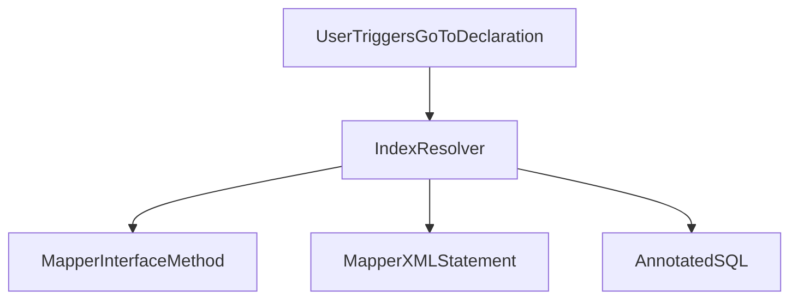
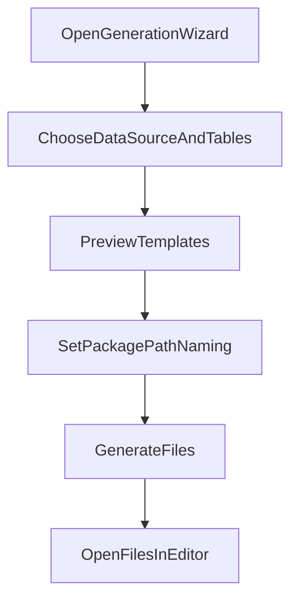

## 产品概述

- **名称**：imybatis（IntelliJ 平台插件）
- **目标**：提升 MyBatis/MyBatis Plus 在 IntelliJ 系列 IDE 的开发效率，提供精准导航、智能提示、模板化代码生成。
- **受众**：使用 Java（首版）+ MyBatis/MyBatis Plus 的企业/个人开发者；后续扩展 Kotlin。
- **运行环境**：JDK 17+，Gradle 8.14+，Kotlin 1.9.24+；IDE 版本 2025.3 系列。

## 目标与范围

- **功能覆盖**
  - MyBatis 与 MyBatis Plus：导航、提示、代码生成三大能力对齐。
  - 首版重点：MyBatis/MyBatis Plus 常见开发场景下的精确导航与提示，减少「找不到 XML/找不到 SQL/类型对不上」的问题。
- **语言范围**
  - 首版：Java 项目。
  - 后续版本：扩展 Kotlin 项目支持（通过单独开关或自动识别）。
- **数据库方言范围**
  - 首版内置：MySQL / MariaDB、PostgreSQL。
  - 其他方言（SQL Server、Oracle 等）作为后续版本规划。
- **运行与架构约束**
  - 以最高精度为优先，可接受较重索引与分析。
  - 插件核心能力（导航、提示、生成）必须离线可用。
  - 允许提供可选的在线增强能力（如云模板、更新检查、可选 AI 辅助），但需显式开启。
- **IDE 覆盖范围**
  - IntelliJ IDEA Ultimate 2025.3。
  - IntelliJ IDEA Community 2025.3。
  - Android Studio 2025.3。

## 用户画像与核心使用场景

- **用户画像**
  - **后台服务开发工程师**
    - 日常大量使用 MyBatis/MyBatis Plus 编写接口、Service、DAO 层。
    - 需要频繁在 Entity、Mapper 接口、Mapper XML、SQL 之间跳转。
  - **数据中台 / 报表 / ETL 开发工程师**
    - 项目中充斥各类复杂 SQL、动态 SQL。
    - 对 SQL 提示、列名提示和类型校验较敏感。
  - **团队技术负责人 / 架构师**
    - 希望通过统一的代码生成模板规范项目结构和风格。
    - 有标准 Entity/Mapper/Service/Controller 代码骨架需求。

- **核心场景**
  - **场景 1：快速导航**
    - 从 Service/Controller 代码跳入 Mapper 接口方法。
    - 再从 Mapper 接口方法一键跳转到对应 Mapper XML 中的 SQL 语句或注解 SQL。
    - 反向：从 XML 中的 `select`/`update` 节点跳转回对应的 Mapper 接口方法。
  - **场景 2：智能提示与校验**
    - 在 Mapper XML 中书写 SQL 时，获得表名、列名的自动补全。
    - 编写 `#{param}` 时提示对应方法参数或 POJO 字段。
    - 自动校验 XML/注解 SQL 中配置的 `parameterType`、`resultType`、`resultMap` 是否和 Mapper 方法签名及 Entity 类型匹配。
  - **场景 3：代码生成**
    - 选择数据库数据源和数据表，一键生成：
      - Entity（含字段、主键、注解等）。
      - Mapper 接口。
      - Mapper XML（基础 CRUD）。
      - 可选 MyBatis Plus 风格的 Service、Controller。
    - 使用团队统一的自定义模板，生成的代码风格与项目规范保持一致。
  - **场景 4：MyBatis Plus 特化支持**
    - 基于 `BaseMapper<T>` 泛型 T 自动识别实体与表的映射。
    - 支持对 `QueryWrapper` / `LambdaQueryWrapper` 等的列名提示（基于实体字段）。
    - 对 MyBatis Plus 代码生成场景（Controller/ServiceImpl）提供快速模板生成。

## 功能需求

### 1. MyBatis / MyBatis Plus 代码导航

- **基础跳转能力（与 IDEA 原生代码导航一致）**
  - **Mapper 接口方法 → Mapper XML**
    - 支持从 Mapper 接口方法（Java）跳转到对应 Mapper XML 中的：
      - `select`/`insert`/`update`/`delete` 等语句节点（通过 `id` 匹配）。
      - 如果一个方法对应多个 SQL（如通过 `databaseId` 区分），在跳转时提供选择弹窗。
  - **Mapper 接口方法 → 注解 SQL**
    - 若方法使用 `@Select`、`@Insert` 等注解直接嵌入 SQL，支持跳转到注解位置或弹出 SQL 编辑视图。
  - **Mapper XML / 注解 SQL → Mapper 接口方法**
    - 在 XML 文件中，支持从 `id`、`resultMap` 等声明位置反向跳转至对应 Mapper 方法。
  - **ResultMap / ParameterMap 导航**
    - 从 ResultMap ID 使用处（XML 中或方法配置中）跳转至定义。
    - 从 ResultMap 定义跳转回使用点（查找引用）。
  - **快捷键与 IDE 集成**
    - 所有跳转能力整合到 IDEA 原生导航能力中：
      - 通过 `Go To Declaration`、`Go To Implementation`、`Find Usages` 等快捷键触发。
      - 不额外引入与 IDEA 行为冲突的新快捷键。
    - 在可跳转的位置（如 Mapper 方法、XML `id`、ResultMap ID、Wrapper 表达式等）行号左侧显示导航图标（gutter icon）：
      - 单击图标弹出可导航目标列表。
      - 鼠标悬停展示简要说明（如“跳转到对应 Mapper XML / 注解 SQL / ResultMap 等”）。

- **Entity 相关导航**
  - **Entity ↔ ResultMap 字段映射**
    - 从 ResultMap 中的 `property` 属性跳转到 Entity 字段。
    - 在 Entity 字段上显示/跳转使用处：哪些 ResultMap 中引用了该字段。
  - **MyBatis Plus：Entity ↔ `BaseMapper<T>`**
    - 支持从 `BaseMapper<User>` 等泛型 T 跳转到实体类。
    - 支持从实体类跳转到相关的 Mapper 接口和 XML。

### 2. MyBatis / MyBatis Plus 代码提示与校验

- **SQL 书写提示**
  - **表名提示**
    - 在 XML/注解 SQL 中输入 `FROM` / `JOIN` 等关键字后，为目标数据源下的表提供补全（MySQL/MariaDB、PostgreSQL）。
  - **列名提示**
    - 在 `SELECT` / `WHERE` / `ORDER BY` / `GROUP BY` 等上下文中，根据已选表提供列名补全。
    - 对多表查询提供 `table.column`、别名形式提示。
  - **SQL 关键字提示**
    - 针对当前方言（MySQL/PostgreSQL）提供常用关键字和函数名补全。

- **参数与类型提示**
  - **Mapper 方法参数 → XML 占位符**
    - 在 XML 中输入 `#{` 或 `${` 时，自动列出 Mapper 方法参数及其字段（若为 POJO）。
    - 支持 `#{user.name}` 形式，提示 POJO 字段名。
  - **`parameterType`/`resultType`/`resultMap` 提示**
    - 在 XML 中这些属性值编辑时，提供 Java 类型（包+类）的补全。
    - ResultMap 提示现有的 ResultMap ID。

- **语义校验**
  - **ID 与引用一致性检查**
    - 所有 `id`、`resultMap`、`parameterMap`、`sql` 片段的定义与引用进行匹配检查。
    - 若引用不存在，标红并提供 Quick Fix（创建占位定义）。
  - **类型匹配检查**
    - Mapper 方法返回值类型与 SQL 返回列/ResultMap 中字段类型是否合理匹配（在可解析范围内给提示，而非强制错误）。
    - `parameterType` 与方法参数类型是否一致。
  - **MyBatis Plus 特有检查**
    - 对 `BaseMapper<T>` 中部分方法（如 `selectById` 等），在 XML 与实体字段映射中给出必要的校验。
    - 对 Wrapper 中的列名使用（如 `eq("name", value)`）进行列名合法性提示（基于实体→表字段映射与方言）。

- **Quick Fix（快速修复）**
  - 一键创建缺失的 ResultMap 壳（自动生成 property 列表，类型从实体推导）。
  - 一键同步/修复 `parameterType` 为正确的参数类型。
  - 对不匹配的列名/字段名提供重命名建议或映射配置建议。

### 3. 代码生成（含自定义模板）

- **生成范围**
  - 默认内置模板：
    - **Entity**：对应数据表字段的 POJO/实体类，支持 Lombok / 注解等配置。
    - **Mapper 接口**：MyBatis 普通接口或 MyBatis Plus `BaseMapper<T>` 接口。
    - **Mapper XML**：基础 CRUD（`insert`、`deleteById`、`updateById`、`selectById`、`selectList` 等）。
    - **可选 Service/Controller**：
      - MyBatis Plus 风格 `IService<T>` / `ServiceImpl<T>`。
      - REST 风格 Controller（可选）。

- **生成流程**
  - 入口：
    - 通过 Tools 菜单、右键项目/模块/包菜单或 MyBatis 视图中的「代码生成」按钮。
  - 步骤：
    1. 选择数据源与数据库。
    2. 选择数据表（支持多选）。
    3. 配置：
       - 基础包名（如 `com.example.user`）。
       - 各类型文件的子包（`entity`、`mapper`、`service`、`controller`）。
       - 命名策略（驼峰/下划线转换、前后缀）。
    4. 选择模板组合：
       - 勾选是否生成 Entity/Mapper/XML/Service/Controller。
       - 选择模板版本（系统默认 / 自定义模板）。
    5. 预览生成结果（文件树 + 选中单个文件预览内容）。
    6. 执行生成，文件写入对应目录，并在编辑器中打开。

- **自定义模板系统**
  - 支持用户定义/管理模板：
    - 模板类型：Entity、Mapper 接口、Mapper XML、Service、Controller 等。
    - 模板语言：推荐 FreeMarker / Kotlin Script（具体实现阶段细化），支持简单表达式与循环。
  - 模板变量：
    - 表相关：表名、表注释、主键列、普通列集合、索引信息等。
    - 字段相关：列名、列类型、是否主键、是否可空、注释等。
    - 项目相关：包名、作者、日期、模块名等。
  - 模板管理 UI：
    - 模板列表（名称、适用场景、最后修改时间）。
    - 新增/编辑/删除模板操作。
    - 模板编辑器：代码区域 + 变量说明面板 + 预览按钮。
  - 校验与预览：
    - 保存模板时，校验语法与占位符正确性。
    - 可选使用示例表结构预览生成结果。

- **类型映射配置**
  - 提供全局/项目级 JDBC→Java 类型映射配置界面。
  - 默认映射根据方言提供合理初始值。
  - 用户可在项目级覆盖部分映射，如 `TINYINT(1)` → `Boolean`。

## 非功能需求

### 性能与资源占用

- **索引性能**
  - 中型项目（约 1000 个 Mapper XML / 500 个 Mapper 接口）首轮索引时间目标：
    - 冷启动首次全量索引 < 60 秒。
  - 增量索引：
    - 单文件修改触发的增量索引 < 3 秒完成。
- **交互性能**
  - 导航操作（Go To Declaration / Find Usages）
    - 绝大部分场景响应时间 < 150 ms。
    - 极端复杂跨模块解析场景 < 400 ms。
  - 代码补全与提示：
    - 用户输入触发补全的延迟 < 150 ms。

- **资源占用**
  - 支持配置后台索引线程数（如：自动/手动限制）。
  - 支持限制内存缓存大小，避免占用过多堆内存。
  - 对大型项目提供分模块索引与懒加载策略。

### 精度与稳定性

- **解析精度**
  - 导航/引用解析准确率目标 ≥ 98%（在预设测试项目集合中度量）。
  - 对于极复杂动态 SQL（如大量 `<if>`/`<choose>` 嵌套）的精度要求适当降低，但要有清晰的降级提示。

- **稳定性**
  - 插件在高强度使用（频繁跳转、频繁编辑）下不得引发 IDE 崩溃。
  - 对索引异常、解析异常进行捕获并记录日志，避免影响用户正常编辑。

### 离线与在线增强

- **离线要求**
  - 所有核心功能（导航、提示、索引、生成）必须在完全离线环境下可用。
  - 插件默认不访问外网。
- **在线增强（可选）**
  - 若未来引入：
    - 云端模板市场。
    - 在线更新检查。
    - AI 辅助 SQL/Mapper 生成或重构建议。
  - 必须：
    - 在设置中有总开关，默认关闭。
    - 提供数据采集范围说明。

### 兼容性

- **框架版本**
  - MyBatis 3.5+。
  - MyBatis Plus 3.5+。
- **JDK 与构建工具**
  - JDK 17+。
  - Gradle 8.14+（插件自身构建）。
- **IDE**
  - IntelliJ IDEA Ultimate 2025.3。
  - IntelliJ IDEA Community 2025.3。
  - Android Studio 2025.3。

## 交互设计与流程

### 导航流程（示意）

说明：
- 用户在 Mapper 方法名、XML 节点 `id`、ResultMap ID、Wrapper 表达式等处触发导航。
- `IndexResolver` 基于预构建索引查找目标声明位置。
- 若存在多个候选，弹出列表供用户选择。

### 代码生成向导流程

说明：
- 向导分为多个步骤，顶部有进度条（步骤名：数据源与表 → 模板选择 → 配置 → 预览 → 生成）。
- 支持返回上一步重新选择。

### 自定义模板管理

- **模板列表页**
  - 显示字段：
    - 模板名称。
    - 模板类型（Entity / Mapper / XML / Service / Controller）。
    - 最后修改时间。
  - 支持操作：
    - 新建模板。
    - 编辑模板。
    - 删除模板。
    - 导入/导出模板（文件形式）。

- **模板编辑页**
  - 左侧：模板代码编辑区域（带语法高亮与简单检查）。
  - 右侧：变量说明面板，按类别展示可用变量（表、列、项目、作者等）。
  - 底部：预览区域（可基于示例表结构或用户选择的真实表结构）。
  - 操作：
    - 保存模板（带语法与占位符校验）。
    - 预览生成结果。

## 数据与索引设计（概要）

- **扫描来源**
  - 源码目录：
    - Mapper 接口（Java）。
    - 实体类（Java）。
  - 资源目录：
    - Mapper XML 文件。
  - 注解 SQL：
    - Java 源文件的 `@Select`、`@Insert`、`@Update`、`@Delete`、`@SelectProvider` 等。

- **索引内容**
  - Mapper 接口：
    - 接口名、包名。
    - 方法签名（方法名、参数类型、返回类型、注解）。
  - Mapper XML：
    - `id`、`resultMap`、`parameterMap`、`sql` 片段 ID。
    - 每个 SQL 语句的文本片段及上下文（用于定位与导航）。
  - ResultMap：
    - ID、type、字段映射列表（property、column、jdbcType 等）。
  - MyBatis Plus：
    - `BaseMapper<T>` 泛型 T 及其与表结构的关系（结合实体注解与数据库元数据）。

- **方言支持**
  - MySQL/MariaDB：
    - 支持通过 JDBC 元数据或简单解析 DDL 获取表结构。
  - PostgreSQL：
    - 支持从信息模式或 DDL 中解析。
  - 用途：
    - 提示表/列名。
    - 类/字段与列类型映射。
    - 生成 CRUD 语句（考虑限制：只支持常见模式，不覆盖所有方言特性）。

- **缓存与更新策略**
  - 项目级持久化缓存（可选）：
    - 缓存索引结果，避免每次重启都从零开始。
  - 内存缓存（LRU）：
    - 热门 Mapper/实体的解析结果常驻。
  - 更新触发：
    - 文件保存时触发该文件的增量索引。
    - 数据源变更（如表结构刷新）时更新表/列缓存。

## 兼容性矩阵

- **IDE**
  - IntelliJ IDEA Ultimate 2025.3。
  - IntelliJ IDEA Community 2025.3。
  - Android Studio 2025.3。
- **JDK / 构建**
  - JDK：17+。
  - 构建：Gradle 8.14+，Kotlin 1.9.24+（插件开发）。
- **框架**
  - MyBatis：3.5+。
  - MyBatis Plus：3.5+。
- **数据库**
  - MySQL/MariaDB：首版完全支持。
  - PostgreSQL：首版完全支持。
  - 其他方言：非目标范围，可部分解析但不保证完整功能。

## 版本规划

- **v1.0（首版）**
  - 完成：
    - MyBatis/MyBatis Plus 导航（Mapper ↔ XML/注解 ↔ Entity）。
    - SQL 与参数/类型提示、基础语义校验。
    - 代码生成向导（Entity/Mapper/XML，MyBatis Plus 基础 Service/Controller）。
    - 自定义模板管理 UI。
    - MySQL/MariaDB、PostgreSQL 方言支持。
    - 离线运行、性能达标。

- **v1.1**
  - 扩展：
    - Kotlin 项目支持。
    - 更多数据库方言（如 SQL Server、Oracle）的基础解析与生成支持。
    - 模板分享/云模板市场（视策略而定）。

- **v1.2 及之后**
  - 深化：
    - 更智能的 SQL 语义分析与重构建议。
    - 更复杂动态 SQL 分析与可视化。
    - 可选 AI 辅助（在线增强，遵循隐私与配置要求）。

## 验收标准与指标

- **功能性**
  - 所有列出的导航路径（Mapper ↔ XML/注解 ↔ Entity）在测试样例中均可正确跳转。
  - 常用 SQL 场景（单表、多表、简单动态 SQL）中，表/列/参数/ResultMap 提示可用。
  - 代码生成向导可针对 MySQL/PostgreSQL 的表生成可编译、可运行的标准代码骨架。

- **性能性**
  - 冷启动首次索引时间符合前述指标。
  - 导航/补全延迟在多数场景不感知。

- **稳定性**
  - 在长时间使用（至少一天开发强度）中，错误日志可控，无崩溃。
  - 对异常情况（损坏 XML、非法语法等）有良好错误提示而非崩溃。

- **可用性**
  - 设置界面清晰，用户可方便地：
    - 打开/关闭部分特性。
    - 配置数据源与类型映射。
    - 管理模板。

## 风险与应对

- **动态 SQL 解析困难**
  - 风险：复杂 `<if>`、`<choose>`、`<foreach>` 嵌套影响 SQL 解析精度。
  - 应对：
    - 对此类 SQL 的提示与校验采用保守策略。
    - 提示“复杂动态 SQL，仅部分分析”的标签。

- **多方言差异**
  - 风险：不同方言函数、语法差异大。
  - 应对：
    - 首版仅对 MySQL/MariaDB、PostgreSQL 做深度支持。
    - 其他方言标注为“实验性/部分支持”。

- **大型项目性能风险**
  - 风险：项目过大导致索引时间超标。
  - 应对：
    - 分模块索引，按需加载。
    - 提供性能配置选项。

- **模板复杂度与学习成本**
  - 风险：自定义模板 DSL 过于复杂，用户难以掌握。
  - 应对：
    - 提供丰富的内置模板与示例。
    - 在 UI 中提供变量说明和预览能力。

